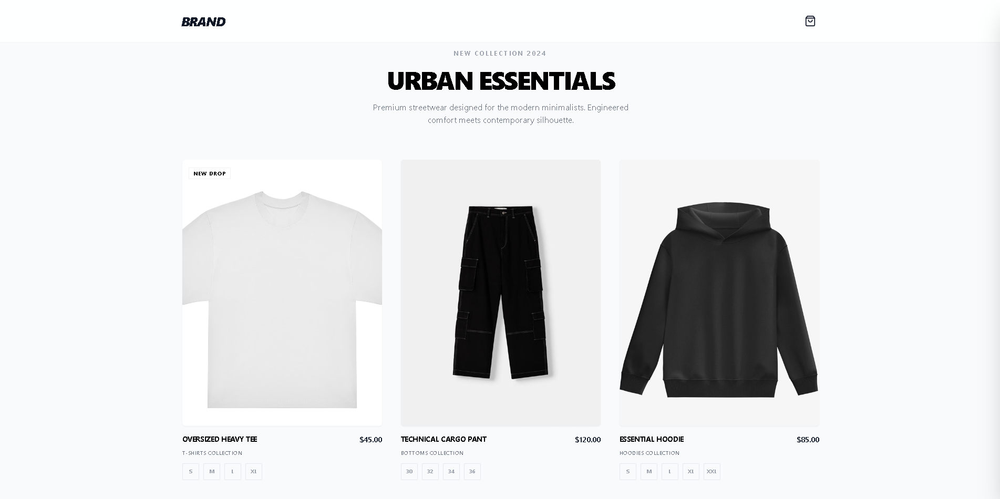

# Concept: Interactive Lookbook

> Un experimento para recrear la experiencia de compra de una marca de moda High-End.




##  Tecnologías

* React + TypeScript
* Tailwind CSS
* Framer Motion

##  Detalles 


1.  El "Shake" de error: Si intentas comprar sin elegir talla, el botón no funciona y las tallas vibran en rojo. Me parece una forma menos agresiva de avisar al usuario que un `alert()`.
2.  Estado visual de compra: El botón no es estático. Pasa por 3 estados (Cargando -> Hecho -> Reset) para dar feedback al usuario, aunque la petición sea falsa.
3.  Sin librerías pesadas: Todo el estado del carrito se gestiona con lógica de React, sin Redux ni herramientas complejas que no hacían falta para este tamaño.


Si quieres ver el código o probarlo:

```bash
# 1. Clona el repo
git clone [https://github.com/guill3erm0/interactive-lookbook.git](https://github.com/guill3erm0/interactive-lookbook.git)

# 2. Instala 
npm install

# 3. Ejecuta
npm run dev